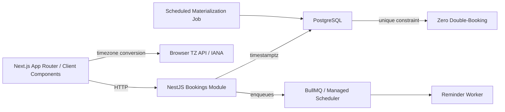

# Chronos — Implementation Plan

## 1. Executive Summary
Chronos is a timezone-safe appointment scheduling platform where providers publish recurring weekly availability and clients book slots across timezones. The hard engineering problems are: (1) guaranteeing zero double-booking under concurrent load via database-level uniqueness, (2) storing all times in UTC with IANA references and converting only at presentation (matching the demo’s "Select Time (EDT)" style), and (3) delivering reminders idempotently via managed delayed jobs. The UI target is `chronos_appointment_scheduling_ui.html`, which defines the full screen set (Dashboard, Calendar, Appointments, Event Types, Availability, Clients, Public Booking flow 1→4, Settings with modals/drawer/toasts).

## 2. Scope & Non-Goals
**In scope:** Provider weekly availability rules → concrete slots (60-day rolling window); atomic booking with DB unique constraint on `(provider_id, slot_start_utc)`; cancellation-window enforcement; reminder pipeline with BullMQ delayed jobs; public multi-step booking page; provider dashboard/calendar/appointments/event-types/clients/settings screens; dark mode + responsive layout + empty states; load-test proof of zero double-bookings; DST edge-case test suite.

**Explicitly out of scope (from PRD):** Payment collection; complex recurring rules beyond simple weekly pattern; provider discovery/marketplace (single provider or fixed list); full billing/analytics/reports screens (demo shows nav badges only — wire to minimal placeholders).

**Demo UI mapping:** All major screens map to in-scope features except Reports/Analytics/Billing tabs (nice-to-have placeholders). The public booking flow (steps 1–4), appointment details drawer, command palette (⌘K), new-appointment modal, toast system, and sidebar workspace switcher are all wired to real APIs.

## 3. Architecture Overview

Mermaid diagram:

- **Monorepo:** Turborepo + pnpm workspace (shared `tsconfig`, lint, CI build/test pipeline).
- **Frontend:** Next.js App Router. Availability display via Server Components (timezone conversion at render time using `Intl.DateTimeFormat` with provider/client IANA zone); booking submission is a Client Component boundary (form + POST). Matches PRD §9 and demo screens.
- **Backend:** NestJS module `bookings`. Booking creation is a single transactional write with DB unique constraint rejecting the loser — no app-level lock.
- **Storage:** PostgreSQL `timestamptz`. Provider `timezone`, slot `slot_start_utc`, client display converted at presentation.
- **Scheduling:** No app-local cron. Materialization job and reminder enqueuing via managed scheduler → BullMQ.
- **Timezone:** All stored UTC + explicit IANA reference (`providers.timezone`, request `tz=` query param, client browser zone for display). DST never shifts booked slot real-world time because the UTC anchor is fixed.

**Demo screen → backend mapping:**
- Dashboard → `GET /bookings/mine` + today-filtered query + KPI aggregates
- Calendar → `GET /providers/:id/availability?tz=` + event data
- Appointments → `GET /bookings` with filter/status/search
- Event Types → `GET/POST /event-types`
- Availability → `GET/PUT /providers/:id/availability`; materialization writes `slots`
- Clients → `GET /clients` with search/filter
- Public Booking → `GET /providers/:id/availability` + `POST /bookings`
- Settings → `GET/PUT /providers/:id/profile`, `/integrations`
- Modal/Drawer → Client Component state (no separate endpoint needed)

## 4. Data Model
Full tables from PRD, expanded for demo fields.

| Table | PK | Key Columns / Types | Constraints / Indexes |
|---|---|---|---|
| `providers` | `id` UUID | `name`, `timezone` (IANA, e.g. `America/New_York`), `cancellation_window_hours` int, `slug` unique, `created_at` timestamptz | PK; `slug` unique; `timezone` for materialization |
| `availability_rules` | `id` UUID | `provider_id` FK, `day_of_week` int(0-6), `start_time` time, `end_time` time, `active` bool | FK; index on `(provider_id, day_of_week)` |
| `slots` | `id` UUID | `provider_id` FK, `slot_start_utc` timestamptz, `slot_end_utc` timestamptz, `status` (`available`/`booked`/`blocked`) | **UNIQUE `(provider_id, slot_start_utc)`**; index on `(provider_id, slot_start_utc)` for p95 <200ms |
| `bookings` | `id` UUID | `slot_id` FK UNIQUE, `client_id` UUID (or email if no auth), `status` (`booked`/`completed`/`cancelled`/`no_show`), `version` int (optimistic concurrency), `notes` text, `client_notes` text, `created_at` | `slot_id` UNIQUE (double-booking guard); `version` for optimistic updates |
| `reminder_jobs` | `id` UUID | `booking_id` FK, `offset_type` (`24h`/`1h`), `sent_at` timestamptz, `status` (`pending`/`sent`/`failed`) | Unique on `(booking_id, offset_type)`; index on `status` + `sent_at` |
| `clients` | `id` UUID | `email` unique, `name`, `company`, `phone`, `avatar_url` | `email` unique; index for CRM search |
| `event_types` | `id` UUID | `provider_id` FK, `title`, `duration_minutes`, `price`, `location`, `slug` unique, `description`, `active` bool | `slug` unique |

**Notes:**
- `slots` materialized by rolling-window job (e.g., 60 days ahead). Once published, IDs are stable.
- `bookings.version` supports optimistic concurrency on update/cancel (not strictly needed if only insert + cancel, but included for future lifecycle edits).
- Additional demo support: `clients.total_bookings` (denormalized or computed), `bookings.event_type_id` FK if needed; keep PRD core minimal and add only what screens require.

## 5. Core Flows (mapped to demo screens/steps)

**Provider publishes weekly availability → materialization → Availability screen**
1. Provider edits weekly schedule (Availability screen, timezone selector + day toggles).
2. Save writes `availability_rules`.
3. Materialization job (scheduled) creates concrete `slots` for rolling window from rules, skipping existing.
4. Availability query (`GET /availability?tz=`) converts each `slot_start_utc` to target zone for display.

**Client views slots in local timezone → Public Booking page steps 1→2**
1. Client opens public link (`/book/:provider` or via slug).
2. Client selects event type (step 1, demo screen).
3. Client picks date + time; presentation layer converts `slot_start_utc` to browser/client `tz` (step 2, "Select Time (EDT)").
4. Client submits form (step 3); POST `/bookings` with `slot_id`, `client_email`, `name`, `notes`.

**Atomic booking (step 4 + confirmation)**
- Transaction: insert `bookings` with `slot_id`; DB unique constraint on `slots` + `bookings.slot_id` ensures if two concurrent requests target same slot, exactly one succeeds.
- On success: slot status updated to `booked`; success screen shown (step 4 confirmation with meeting link, calendar add).
- On failure: 409 Conflict; user shown " Slot just taken — please pick another."

**Cancellation (Appointment details drawer)**
- `POST /bookings/:id/cancel` checks `slot_start_utc` against `cancellation_window_hours`; if within window, reject 403.
- On success: `bookings.status = cancelled`; reminder jobs for that booking canceled/deleted.

**Reminder scheduling & delivery**
- At booking creation, enqueue BullMQ delayed jobs keyed `(booking_id, offset_type)` for each configured offset (24h, 1h).
- Job worker sends reminder; writes `reminder_jobs` record; unique constraint prevents duplicate sends on retry.
- Idempotency: if job retries, `reminder_jobs` uniqueness on `(booking_id, offset_type)` blocks second insert after first `sent_at` written.

**Booking lifecycle (Dashboard / Calendar / Appointments)**
- Status transitions: `booked` → `completed` (provider action) | `cancelled` (within window) | `no_show`.
- Updates go through optimizer/version or direct updates with audit.

**Dashboard / Calendar / Appointments list**
- Dashboard: aggregate queries (today’s schedule, KPIs, activity log).
- Calendar: month/week/day/agenda views consuming availability + bookings for date range.
- Appointments: paginated/filtered table with status badges, search, manage button opening drawer.

## 6. API Surface

| Method | Path | Auth | Request / Response | Demo Consumer |
|---|---|---|---|---|
| `GET` | `/providers/:id/availability` | Public / Provider | Query `?tz=` (IANA); returns slots array with `start_local`, `end_local` | Public booking step 2; Availability screen |
| `POST` | `/bookings` | Client / Public | `{ slot_id, client_name, email, phone?, notes?, event_type_id? }`; returns booking + confirmation | Public booking step 3→4 |
| `POST` | `/bookings/:id/cancel` | Provider / Client | `{ reason? }`; checks cancellation window | Details drawer cancel |
| `GET` | `/bookings/mine` | Provider | Filter/status/search/pagination | Appointments tab; Dashboard today |
| `GET` | `/bookings/:id` | Provider / Client | Full booking + slot + client | Details drawer |
| `GET` | `/providers/:id/calendar` | Provider | `?start=&end=`; returns events in provider TZ | Calendar screen |
| `GET/PUT` | `/providers/:id/availability` | Provider | Availability rules + timezone | Availability screen |
| `GET/POST` | `/event-types` | Provider | Event type CRUD | Event Types screen |
| `GET/POST` | `/clients` | Provider | Client search/filter + profile | Clients screen; details drawer |
| `GET/PUT` | `/providers/:id/settings` | Provider | Profile, integrations, notifications | Settings tabs |

**Internal / Admin:**
- `POST /admin/materialize` (or scheduler invocation) — creates slots from rules; returns count.
- `GET /admin/reminders/status` — job stats for ops.
- `POST /admin/reminders/retry` — retry failed jobs.

## 7. Concurrency & Correctness Strategy
- **Mechanism:** `slots` has `UNIQUE(provider_id, slot_start_utc)`. `bookings` has `UNIQUE(slot_id)`. Booking transaction: `INSERT INTO bookings ...`; if `slot_id` already booked, unique violation → rollback → 409. No SELECT-for-update needed; database enforces it.
- **Load test:** Concurrent requests (N=20–50) targeting identical `slot_id`; verify exactly 1 success, rest 409; verify `slots.status` = `booked` for exactly one booking.
- **Idempotency:** Reminders use `(booking_id, offset_type)` uniqueness on `reminder_jobs`; retries that attempt second insert block; only first `sent_at` commits.
- **Optimistic concurrency:** `bookings.version` incremented on updates; prevent lost updates if two providers edit same booking (rare but included).

## 8. Timezone & DST Strategy
- **Storage:** `timestamptz` (UTC). Provider timezone stored explicitly (`providers.timezone`). Client display uses either request `tz=` or browser `Intl.DateTimeFormat`.
- **Conversion points:** Presentation layer only. Server returns UTC; client renders in local zone (matches demo “Select Time (EDT)”). Never store local times.
- **DST tests (synthetic):**
  - Spring-forward gap (e.g., 2026-03-08 02:00 → 03:00 in America/New_York): a 02:30 slot should not exist; booking at 03:00 stays at 03:00 real-world.
  - Fall-back overlap (2026-11-01 01:00 → 01:00 again): 01:30 ambiguity resolved by provider’s fixed rule + UTC anchor.
- **Rule:** DST never shifts a booked slot’s real-world time because UTC anchor is immutable. Only display strings change.

## 9. Background Jobs & Scheduling
- **Materialization:** Rolling 60-day window. Job runs on managed scheduler (not cron in container); enqueues if using queue, or direct DB write. Creates `slots` for future dates from `availability_rules`. Skips existing slots (idempotent).
- **Reminders:** At `POST /bookings`, enqueue BullMQ delayed jobs: delay = `slot_start_utc - offset` (e.g., 24h before). Job key = `reminder:${booking_id}:${offset_type}`.
- **Worker:** Consumes queue; sends reminder; writes `reminder_jobs`; handles retry with exponential backoff. Unique DB record prevents duplicate sends.
- **No local cron:** All scheduled work enters via scheduler API / queue enqueue, so any instance can process.

## 10. Frontend Architecture
- **Next.js App Router:** Server Components for availability data fetch and conversion; Client Component for booking form/interactions.
- **Time zone UX:** Public booking allows client to confirm/select timezone (as demo shows “EDT” label); conversion done via `Intl.DateTimeFormat` with `timeZone` option.
- **Pages / Components mapped 1:1 to demo:**
  - `app/dashboard/page.tsx` — KPIs, today timeline, activity, share card, mini calendar
  - `app/calendar/page.tsx` — month/week/day/agenda with filters (event types), mini nav
  - `app/appointments/page.tsx` — search + status filters + table + details drawer
  - `app/event-types/page.tsx` — grid cards with active toggle + copy link
  - `app/availability/page.tsx` — timezone bar + weekly schedule + buffer/minimum settings
  - `app/clients/page.tsx` — search + cards with bookings/spent + profile
  - `app/public-booking/page.tsx` — steps 1–4 container; event selection, date/time picker, form, confirmation
  - `app/settings/page.tsx` — tabs (profile, integrations, notifications, branding, security, billing)
  - Shared layout with sidebar (logo, workspace switcher, nav with badges), header (title, command bar ⌘K, new appointment, notifications, dark toggle, profile), main content.
- **Modals / Drawers:** Client Component state (command palette, new appointment, appointment details, block time, edit event). Toast system via context/provider.
- **Dark mode:** `darkMode` class toggle with `dark:` Tailwind utilities; demo uses `dark:bg-slate-950` / `dark:text-slate-100`.
- **Responsive:** Mobile sidebar overlay (`md:translate-x-0`), grid adjustments (`sm:grid-cols-*`), button label hiding (`hidden sm:inline`).
- **Empty states:** Toggleable `emptyStateMode`; shown in schedule, clients, appointments with appropriate icons + action buttons.

## 11. Testing Strategy
- **Unit:** Components, timezone conversion utilities (`formatTimeInZone`), availability rule parsing.
- **Integration:** API endpoints with DB (test DB or transactions); booking flow end-to-end; reminder enqueue + worker.
- **Load / Concurrency:** Simultaneous requests to same `slot_id`; assert exactly 1 booking, 0 double-booked slots.
- **DST:** Synthetic dates for spring-forward gap and fall-back overlap; verify slot times remain fixed in UTC, display updates correctly, no missing/duplicate slots.
- **Idempotency:** Retry reminder job 3×; assert exactly 1 `reminder_jobs` record and exactly 1 send.
- **UI smoke:** Compare rendered pages against demo screenshots; verify dark mode, responsive layout, empty states, modal/drawer interactions.
- **Success metrics (from PRD):** 0 double-bookings under load; 0 duplicate reminders; documented DST suite with pass evidence; p95 <200ms availability query.

## 12. Milestones & Implementation Order
From PRD, with sub-tasks and demo-wire dependencies.

**M1 — Walking skeleton:** Scaffold repo (Turborepo + pnpm); Next.js layout + sidebar + header; NestJS `bookings` module with basic schema (`providers`, `slots`, `bookings`); static data; public booking page (step 1 demo). **Deliver:** Build passes; basic page renders.

**M2 — Availability + materialization:** `availability_rules`; materialization job; `GET /providers/:id/availability`; Availability screen wired; calendar grid with events. **Deliver:** Provider can set hours; slots materialized.

**M3 — Atomic booking + concurrency:** `POST /bookings`; unique constraints; load test; public booking steps 1→4 fully wired; confirmation screen. **Deliver:** Zero double-bookings proven; booking flow works.

**M4 — Timezone + DST:** Timezone conversion layer; `tz=` queries; DST test suite; display “EDT” style in public flow; all screens show correct local times. **Deliver:** DST tests pass; multi-tzone display correct.

**M5 — Reminders + cancellation:** BullMQ setup; reminder delayed jobs; `POST /cancel` with window check; details drawer; notifications dropdown. **Deliver:** Reminders idempotent; cancellation enforced.

**M6 — Full end-to-end + polish:** Appointments table + search/filter; clients CRM; event types; settings tabs; command palette; toasts; dark mode; empty states; CI (lint/typecheck/test/build). **Deliver:** Demo parity complete; all screens real-API backed.

**Dependency note:** M2 must complete before M3 (slots needed). M3 before M5 (bookings needed for reminders/cancel). M4 can parallel with M3/M5 (conversion is presentation-only). M6 integrates everything.

## 13. Open Risks & Mitigations
- **DST test design (PRD §13):** Synthetic dates are easy to get wrong. Mitigation: dedicated test-design task with known reference dates (e.g., 2026-03-08, 2026-11-01 in `America/New_York`); verify with `dateutil` / `Intl`; document exactly what passes.
- **UI fidelity to large demo:** Demo is a single large HTML file with rich interactions (drawer, modal, command palette, workspace switcher). Mitigation: build shared layout first; use component library / consistent design tokens; reference demo directly for pixel-level details (colors `brand-500`, `slate-850`, glass panels, gradients).
- **Time zone conversion errors in public flow:** Client picks time in local zone, but server must interpret correctly. Mitigation: always send `slot_start_utc` to server; never send local time for booking; client only selects from already-converted slot list.
- **Concurrent booking at scale:** Load test may reveal DB contention. Mitigation: index on `slots(provider_id, slot_start_utc)`; transaction is short (single insert); no long-held locks.
- **Reminder delivery failure / duplication:** Job worker crash after send but before DB write. Mitigation: DB unique constraint + transactional write (send + insert together if possible, or idempotent API that checks before sending; if DB write fails, retry will find record and skip).

## 14. Definition of Done
Maps to PRD §12 Success Metrics + demo parity.

- [ ] Schema deployed; `slots` has `UNIQUE(provider_id, slot_start_utc)`; `bookings` has `UNIQUE(slot_id)`.
- [ ] Load test executed with N concurrent requests for same slot; result: exactly 1 success, 0 double-booked.
- [ ] DST test suite exists with synthetic spring-forward and fall-back cases; all pass; evidence documented.
- [ ] Reminder pipeline runs; retry simulation passes; 0 duplicate reminders.
- [ ] Cancellation-window enforcement works (`POST /cancel` rejects inside window).
- [ ] All demo screens rendered and backed by real APIs (Dashboard, Calendar, Appointments, Event Types, Availability, Clients, Public Booking 1→4, Settings with tabs/modals).
- [ ] Availability query p95 <200ms verified for 60-day window.
- [ ] Dark mode, responsive layout, empty states, command palette, toasts, drawer, modal match demo behavior.
- [ ] CI passes (lint, typecheck, tests, build).
- [ ] Implementation plan (`docs/IMPLEMENTATION_PLAN.md`) reviewed and approved.

**Wait for review / approval before writing application code, schema migrations, or scaffolding.**
